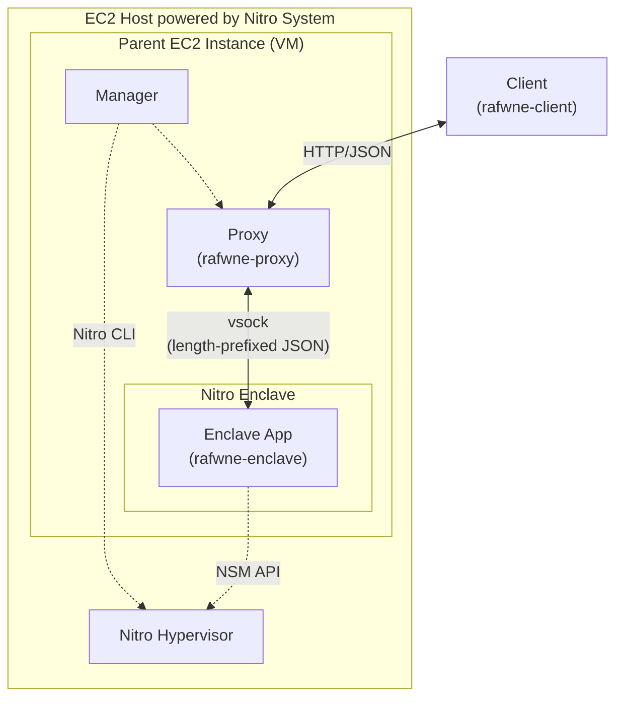
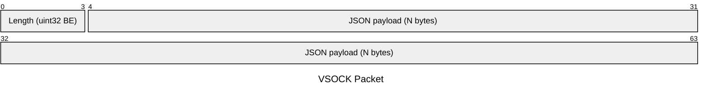
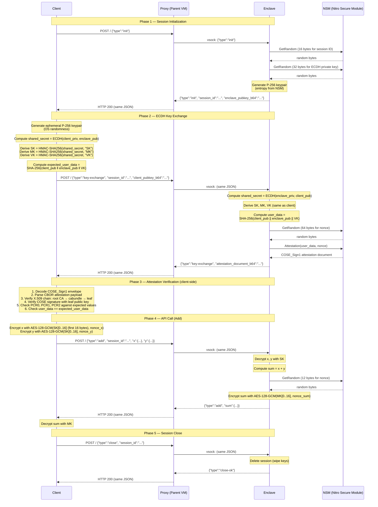
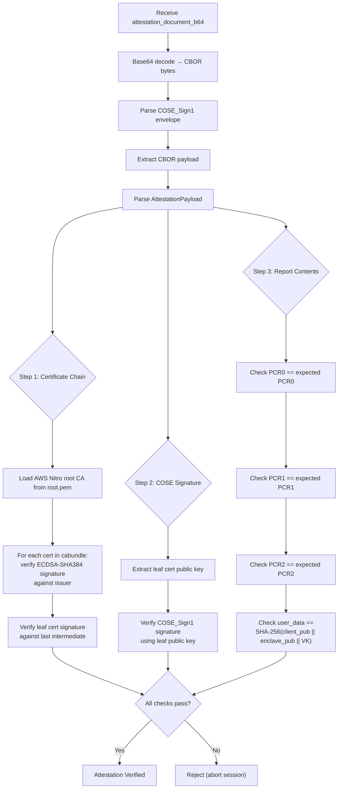

# Architecture

This document describes the architecture, wire protocol, cryptographic
operations, and attestation verification flow of **Humane-RAFW-NE** in detail.

## High-Level Overview

Humane-RAFW-NE implements a minimal but complete
**handshake → remote attestation → API call via secure channel** flow on top of
AWS Nitro Enclaves. The system consists of three application components
(client / proxy / enclave) that communicate through two transport layers:



### Trust Boundaries

| Component | Trust | Notes |
| --------- | ----- | ----- |
| **EC2 Host** | Trusted | Powered by **AWS Nitro System**. It consists of **Nitro Cards** (SoC/ASICs separated from the main board), **Nitro Security Chip** (HSM-like security chip integrated into the main board), and **Nitro Hypervisor** (minimalistic firmware-like hypervisor). |
| **Parent EC2 Instance** / Proxy | Untrusted | Standard EC2 instance; the proxy can observe encrypted traffic but cannot decrypt or tamper with it |
| **Nitro Enclave** | Trusted / Attestable | Isolated VM with no persistent storage, no network, and no interactive access — even the Parent VM operator cannot inspect its memory |
| **Client** | — | Trusts the AWS Nitro Enclaves root CA; verifies enclave identity through remote attestation |

### Transport Layers

| Layer | Transport | Trust |
| ----- | --------- | ----- |
| Client ↔ Proxy | HTTP POST (`application/json`) | Untrusted network — confidentiality/authenticity are provided at the application layer by AES-GCM once the session keys are established via ECDH + attestation verification |
| Proxy ↔ Enclave | AF_VSOCK with 4-byte big-endian length prefix | Hypervisor-level channel (no network stack); provided by the Nitro System |

- **Client ↔ Proxy** — Standard HTTP. All requests are `POST /` with
  `Content-Type: application/json`. Responses are `200 OK` with
  `Content-Type: application/json`.
- **Proxy ↔ Enclave** — AF_VSOCK (virtio socket). Each message is framed with a
  **4-byte big-endian length prefix** followed by the JSON payload:



The proxy opens a new vsock connection for each HTTP request, writes one request
frame, reads one response frame, and closes the connection.

## Some Features of AWS Nitro System

### Hardware-Offloaded Virtualisation

In a traditional virtualisation stack, the hypervisor or VMM is responsible for
a wide range of tasks — I/O virtualisation, network and storage management,
hardware monitoring, and more — resulting in a large, privileged codebase that
every tenant must implicitly trust. The Nitro System takes a fundamentally
different approach: these responsibilities are offloaded to purpose-built
hardware components (Nitro Cards and the Nitro Security Chip), leaving only a
minimal, firmware-like hypervisor in software. This separation both improves
performance — I/O paths run on dedicated ASICs rather than contending for host
CPU cycles — and dramatically shrinks the trusted software footprint, reducing
the attack surface that a security-conscious user must evaluate.

### Nitro Enclaves Security

Nitro Enclaves inherit the same security protections as standard EC2 instances
provided by the Nitro System — in particular, the Nitro Hypervisor enforces
the same hardware-level isolation boundaries. When creating an enclave, the
parent instance allocates a fixed number of vCPUs and a fixed amount of memory
to it. These resources are carved out (hot-unplugged) from the parent instance,
and the Nitro Hypervisor uses them to create a separate, isolated VM — the
enclave. Because the resources are subtracted from the parent, the parent VM
and the enclave do not share memory.

Nitro Enclaves impose further restrictions beyond standard EC2 isolation: an
enclave has no persistent storage, no external network access, and no
interactive access such as SSH. The only communication channel between the
parent instance and the enclave is a local vsock connection. These constraints
significantly reduce the enclave's attack surface.

Nitro Enclaves also support cryptographic attestation. The Nitro Hypervisor
produces a signed attestation document that includes measurements of the
enclave image. This enables relying parties to verify both the identity
(integrity) and the isolation (confidentiality) of the enclave before
entrusting it with sensitive data.

### Formally Verified Security

Certain components of the Nitro System have been formally verified — their
security properties are mathematically proved using Isabelle/HOL and bounded
model checking. The Nitro System itself is not attestable; however, these
formal proofs provide the strongest available guarantees of security, under the
assumption that the relying party trusts AWS.

Many software components of the Nitro System — including Nitro CLI and the Nitro
Secure Module API Library — are written in Rust. Rust's ownership model and
strong type system statically eliminate broad classes of bugs at compile time,
most notably memory-safety violations. This project is written entirely in Rust
as well, both to interface directly with the Nitro Enclaves software stack and
to carry these same safety guarantees into our own code.

<details>

<summary>Theoretical Notes</summary>

Type checking can be viewed as a lightweight form of formal verification. A
static type system formally specifies certain safety properties — such as the
absence of particular classes of runtime errors — and successful type checking
constitutes a machine-checked proof that the program satisfies them. Even
mainstream languages benefit from this guarantee.

In more expressive settings based on dependent type theory, types can encode
rich specifications of program behaviour; writing a well-typed program then
amounts to constructing a mathematical proof that the implementation meets its
specification. This correspondence between proofs and programs is made precise
by the Curry–Howard isomorphism, which establishes a structural isomorphism
between propositions and types, between proofs and programs, and so forth.

</details>

## Component Details

### 1. Enclave (`rafwne-enclave`)

The enclave binary runs inside the Nitro Enclave VM. It listens on an AF_VSOCK
port (default `5000`) and processes length-prefixed JSON messages in a
synchronous request-response loop.

#### Key responsibilities

- **Session management** — each client session gets a unique ID (16 random
  bytes, base64url-encoded) and an ephemeral ECDH P-256 keypair. Sessions are
  stored in a global `HashMap<String, Session>` behind a `Mutex`.
- **ECDH key exchange** — on `KeyExchange`, the enclave computes the shared
  secret with the client's public key, then derives three symmetric keys via
  HMAC-SHA256:
  - **SK** (Session Key) — used by the client to encrypt inputs
  - **MK** (MAC Key) — used by the enclave to encrypt outputs (the name is
    historical; it serves as an AES-128-GCM encryption key, not a standalone
    MAC)
  - **VK** (Verification Key) — bound into the attestation document
- **Attestation** — after key exchange, the enclave requests an attestation
  document from the Nitro Secure Module (NSM). The `user_data` field is set to
  `SHA-256(client_pub || enclave_pub || VK)`, binding the attestation to the
  specific session.
- **Addition API** — the `Add` request decrypts two AES-128-GCM ciphertexts
  (using SK), adds the underlying `u32` values, encrypts the result (using MK),
  and returns it.
- **Entropy** — all random bytes (session IDs, nonces, ECDH private keys) are
  sourced from the NSM hardware RNG via `nsm_process_request(GetRandom)`.

### 2. Proxy (`rafwne-proxy`)

The proxy is a lightweight, **untrusted** HTTP-to-vsock bridge that runs on the
parent EC2 instance. It accepts `POST /` requests, forwards the raw JSON body to
the enclave over vsock, and returns the enclave's response.

#### Key characteristics

- Stateless — opens a new vsock connection per HTTP request.
- Uses `tiny_http` for the HTTP server.
- Enforces a configurable maximum body size derived from `--vsock-buffer-size`.
- Returns HTTP 502 on vsock errors.

### 3. Client (`rafwne-client`)

The client orchestrates the full protocol flow:

1. session init
2. ECDH key exchange
3. attestation
4. verification
5. addition API call
6. session close

#### Key responsibilities

- **ECDH** — generates an ephemeral P-256 keypair and computes the shared
  secret with the enclave's public key.
- **Key derivation** — derives SK, MK, VK identically to the enclave.
- **Attestation verification** (`attestation.rs`):
  1. Decodes the COSE_Sign1 envelope.
  2. Parses the CBOR attestation payload.
  3. Verifies the X.509 certificate chain from the AWS Nitro root CA down to
     the leaf.
  4. Verifies the COSE signature using the leaf certificate's public key.
  5. Checks PCR values (PCR0, PCR1, PCR2) against expected values from `client-configs.json`.
  6. Checks that `user_data == SHA-256(client_pub || enclave_pub || VK)`.
- **Addition API call** — encrypts inputs with AES-128-GCM (SK), sends the
  `Add` request, decrypts the result with MK.

## Wire Protocol

### Message Types

All messages are JSON objects with a `"type"` field (kebab-case) that determines
the variant. Both `Request` and `Response` use Serde's internally-tagged
representation (`#[serde(tag = "type")]`).

#### Requests (Client → Enclave)

| Type | Fields | Description |
| ---- | ------ | ----------- |
| `init` | *(none)* | Start a new session |
| `key-exchange` | `session_id`, `client_pubkey_b64` | Complete ECDH and request attestation |
| `add` | `session_id`, `x: EncryptedBlob`, `y: EncryptedBlob` | Addition |
| `close` | `session_id` | Close session and wipe keys |
| `attest` | `session_id?`, `user_data_b64?`, `nonce_b64?` | Request an attestation document on demand |

#### Responses (Enclave → Client)

| Type | Fields | Description |
| ---- | ------ | ----------- |
| `init` | `session_id`, `enclave_pubkey_b64` | Session created |
| `key-exchange` | `attestation_document_b64` | Attestation document (COSE_Sign1, base64) |
| `add` | `sum: EncryptedBlob` | Encrypted result |
| `close-ok` | *(none)* | Session closed |
| `attest` | `attestation_document_b64` | Attestation document |
| `error` | `error` | Error message string |

#### EncryptedBlob

```json
{
  "nonce_b64": "<base64 of 12-byte AES-GCM nonce>",
  "ciphertext_b64": "<base64 of ciphertext + 16-byte GCM tag>"
}
```

## Protocol Flow

The complete session lifecycle consists of five phases:
**Init → Key Exchange → Attestation Verification → API Call → Close**.

### End-to-End Sequence Diagram



## Cryptographic Details

### ECDH Key Exchange

| Parameter | Value |
| --------- | ----- |
| Curve | NIST P-256 (secp256r1) |
| Public key encoding | Uncompressed SEC1 (65 bytes: `04 \|\| x \|\| y`) |
| Shared secret | Raw x-coordinate of the ECDH result (32 bytes) |

Both the client and the enclave independently compute the same shared secret:

```text
shared_secret = ECDH(own_private_key, peer_public_key)
              = x-coordinate of (own_private_key × peer_public_key)
```

### Key Derivation

Three 32-byte symmetric keys are derived from the shared secret using
HMAC-SHA256 with fixed labels:

- $\mathtt{SK} := \mathtt{HMAC\_SHA256}\left(\mathtt{shared\_secret}, \mathtt{"SK"}\right)$
  (Session Key) — Client encrypts requests
- $\mathtt{MK} := \mathtt{HMAC\_SHA256}\left(\mathtt{shared\_secret}, \mathtt{"MK"}\right)$
  (MAC Key) — Enclave encrypts responses
- $\mathtt{VK} := \mathtt{HMAC\_SHA256}\left(\mathtt{shared\_secret}, \mathtt{"VK"}\right)$
  (Verify Key) — bound into attestation

Only the first 16 bytes of SK and MK are used as AES-128-GCM keys. VK is used
in its entirety for attestation binding.

### Symmetric Encryption

| Parameter | Value |
| --------- | ----- |
| Algorithm | AES-128-GCM |
| Key size | 128 bits (first 16 bytes of SK or MK) |
| Nonce size | 96 bits (12 bytes) |
| Tag size | 128 bits (16 bytes, appended to ciphertext) |
| AAD | Empty |
| Plaintext encoding | `u32` values are serialized as **4-byte little-endian** before encryption |

**Directionality of keys:**

- **SK** — used by the **client** to encrypt request payloads (e.g., `x` and
  `y` in `Add`). The enclave decrypts with SK.
- **MK** — used by the **enclave** to encrypt response payloads (e.g., `sum` in
  `Add`). The client decrypts with MK.

Nonces are generated randomly: the client uses OS-provided CSPRNG
(`aws_lc_rs::rand::SystemRandom`); the enclave uses the HWRNG via NSM.

### Attestation Binding (user_data)

The attestation document's `user_data` field is set to:

```text
user_data = SHA-256(client_pub || enclave_pub || VK)
```

where `client_pub` and `enclave_pub` are uncompressed SEC1 public keys (65
bytes each), and `VK` is the 32-byte verification key. This binds the
attestation to:

1. **Both parties' identities** (public keys)
2. **The shared secret** (through VK, which is derived from the ECDH shared secret)

The client independently computes the same `user_data` value and verifies it
matches the one in the attestation document.

## Attestation Verification

The client performs the following checks on the attestation document returned
by the `key-exchange` response:

### Attestation Document Structure

The attestation document is a **COSE_Sign1** structure (CBOR Object Signing and
Encryption). Its payload is a CBOR map containing:

| Field | Type | Description |
| ----- | ---- | ----------- |
| `pcrs` | `Map<u32, bytes>` | Platform Configuration Registers (SHA-384) |
| `user_data` | `bytes` | Application-defined data (session binding) |
| `nonce` | `bytes` | Random nonce from NSM |
| `certificate` | `bytes` | Leaf X.509 certificate (DER) |
| `cabundle` | `[bytes]` | Intermediate CA certificates (DER) |

### Verification Steps



### Certificate Chain Verification

The certificate chain is verified from root to leaf:

```text
AWS Nitro Root CA (root.pem)
  └── signs → Intermediate CA 1 (cabundle[0])
        └── signs → Intermediate CA 2 (cabundle[1])
              └── signs → ...
                    └── signs → Leaf Certificate (certificate)
```

Each signature is verified using **ECDSA with SHA-384** (P-384 curve), which is
the signature algorithm used by AWS Nitro Enclaves.

### PCR Values

| PCR | Content |
| --- | ------- |
| PCR0 | Hash of the enclave image (EIF) |
| PCR1 | Hash of the Linux kernel and bootstrap |
| PCR2 | Hash of the application code |

PCR values are SHA-384 hashes (48 bytes). The expected values are obtained from
the output of `nitro-cli build-enclave` and stored in `client-configs.json` as
hex strings.

## On-Demand Attestation (`attest` Request)

In addition to the attestation returned during key exchange, the client can
request a fresh attestation document at any time using the `attest` request
type:

```json
{
  "type": "attest",
  "session_id": "...",
  "user_data_b64": null,
  "nonce_b64": null
}
```

Behavior depends on which optional fields are provided:

| `user_data_b64` | `nonce_b64` | Behavior |
| --------------- | ----------- | -------- |
| provided | provided | Use both as-is (`session_id` is ignored) |
| omitted | omitted | `session_id` required; enclave computes `user_data = SHA-256(client_pub \|\| enclave_pub \|\| VK)` and generates a random nonce |
| provided | omitted | `session_id` required; enclave generates a random nonce |
| omitted | provided | `session_id` required; enclave computes `user_data` from session |

## Security Properties

### What the Protocol Guarantees

1. **Enclave identity** — PCR verification ensures the client is communicating
   with the exact expected enclave image.
2. **Session binding** — The `user_data` field in the attestation document
   cryptographically binds the attestation to the specific ECDH session (both
   public keys + VK).
3. **Input confidentiality** — Client inputs are encrypted with AES-128-GCM
   (SK) and can only be decrypted inside the enclave.
4. **Output confidentiality & authenticity** — Enclave outputs are returned as
   AES-128-GCM (MK). A network attacker (or the untrusted proxy) cannot modify
   ciphertexts without detection by the client.
5. **Forward secrecy** — Ephemeral ECDH keypairs are generated per session;
   compromising one session does not affect others.
6. **Hardware-rooted trust** — The attestation document is signed by the Nitro
   Hypervisor via the Nitro Secure Module, whose certificate chain roots to the
   AWS Nitro Enclaves root CA.
   The Nitro hypervisor is secure-booted with the aid of the hardware
   components of the Nitro System.

### Trust Assumptions

- The **AWS Nitro hypervisor and NSM** are trusted to correctly isolate the
  enclave and produce authentic attestation documents.
- The **proxy is untrusted** — it can observe encrypted traffic but cannot
  decrypt or tamper with it (integrity is ensured by GCM authentication tags
  and attestation verification).
- The **client** trusts the AWS Nitro root CA certificate (`root.pem`) obtained
  from AWS.

## References

- AWS.
  [AWS Whitepaper - The Security Design of the AWS Nitro System](https://docs.aws.amazon.com/pdfs/whitepapers/latest/security-design-of-aws-nitro-system/security-design-of-aws-nitro-system.pdf) (PDF).
- AWS.
  [User Guide - AWS Nitro Enclaves](https://docs.aws.amazon.com/pdfs/enclaves/latest/user/enclaves-user.pdf) (PDF).
- AWS.
  [User Guide - Amazon Elastic Compute Cloud](https://docs.aws.amazon.com/pdfs/AWSEC2/latest/UserGuide/ec2-ug.pdf) (PDF),
  pp. 3070-3103.
- AWS.
  [Nitro Enclaves Command Line Interface (Nitro CLI)](https://github.com/aws/aws-nitro-enclaves-cli),
  GitHub repository.
- AWS.
  [Nitro Secure Module library](https://github.com/aws/aws-nitro-enclaves-nsm-api),
  GitHub repository.
- AWS Labs.
  [AutoCorrode](https://github.com/awslabs/AutoCorrode),
  GitHub repository.
- J.D. Bean, KarimAllah Raslan, and Nathan Chong (AWS).
  Introducing Nitro Isolation Engine: Transparency through Mathematics,
  *AWS re:Invent 2025*.
  [[video]](https://www.youtube.com/watch?v=hqqKi3E-oG8)
- B. Cook, K. Khazem, D. Kroening, S. Tasiran, M. Tautschnig and M.R. Tuttle.
  Model Checking Boot Code from AWS Data Centers.
  In *Proceedings of Computer Aided Verification. CAV 2018.*
  Lecture Notes in Computer Science, Vol. 10982. Springer Cham, 2018.
  DOI: [10.1007/978-3-319-96142-2_28](https://doi.org/10.1007/978-3-319-96142-2_28)
- Dominic Mulligan (AWS).
  Nitro Isolation Engine: formally verifying a production hypervisor,
  *Logic and Semantics Seminar (Computer Laboratory)*.
  [[abstract]](https://talks.cam.ac.uk/talk/index/243943)
- Tobias Nipkow, Markus Wenzel, Lawrence C. Paulson.
  *Isabelle/HOL — A Proof Assistant for Higher-Order Logic*,
  Springer-Verlag Berlin Heidelberg, 2002.
  DOI: [10.1007/3-540-45949-9](https://doi.org/10.1007/3-540-45949-9)
- Tim Sheard, Aaron Stump, and Stephanie Weirich.
  Language-based verification will change the world.
  In *Proceedings of FoSER '10.*
  Association for Computing Machinery, New York, NY, USA, 343–348, 2010.
  DOI: [10.1145/1882362.1882432](https://doi.org/10.1145/1882362.1882432)
